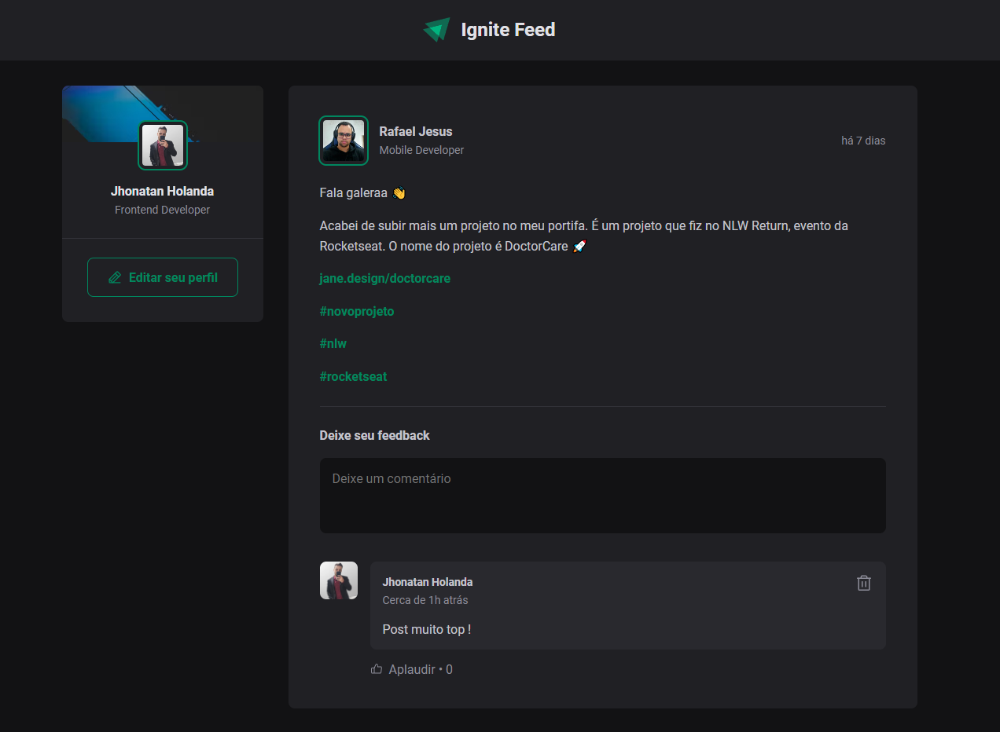

# Projeto Ignite Feed

<h1 align="center">
    
</h1>

### Sobre o projeto

O Projeto tem como objetivo instruir o aluno, criando uma aplicação totalmente do zero em ReactJS, no projeto teremos os conhecimento mais importantes do ReactJS: Estado, Imutabilidade, Keys, Propriedades e Componentes.

---

### Tecnologias
<p>


</p>

### Iniciando o projeto

```bash
# Clonar aplicação

$ git clone https://github.com/Jhonatan-Holanda/01-fundamentos-reactjs-ts

# Acessar a aplicação
$ cd 01-fundamentos-reactjs-ts

# Execute npm i para instalar as dependências
$ npm i

# Inicie a aplicação
$ npm dev

```
